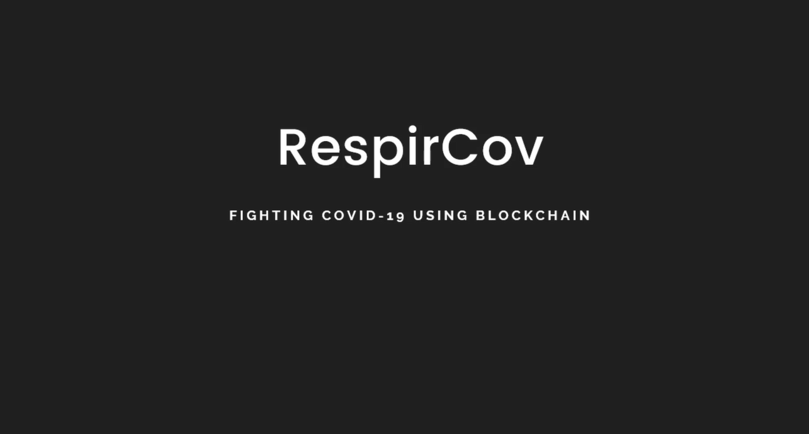
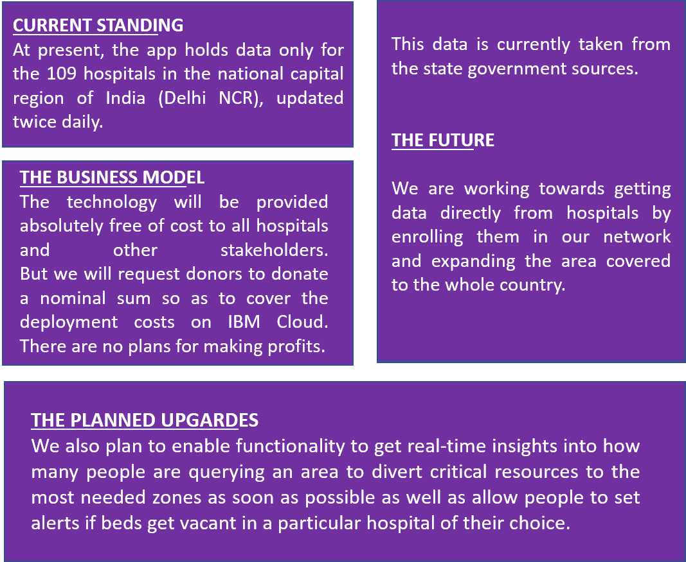
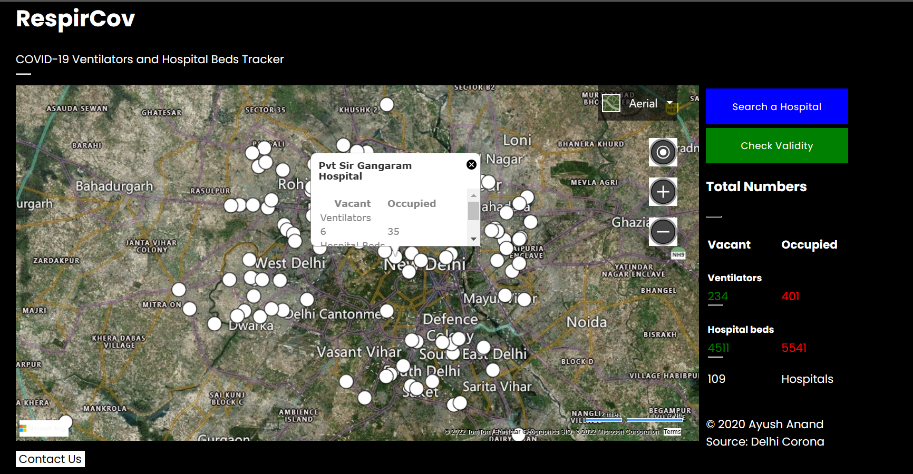

# RespirCov
RespirCov is blockchain based live, interactive ventilator and hospital beds tracker for COVID-19.

## Contents
1. [Short description](#short-description)
1. [Demo video](#demo-video)
1. [The architecture](#the-architecture)
1. [Long description](#long-description)
1. [Project roadmap](#project-roadmap)
1. [Getting started and Testing](#getting-started-and-testing)
1. [Live demo](#live-demo)
1. [Built with](#built-with)
1. [Contributing](#contributing)
1. [Authors](#authors)
1. [License](#license)
1. [Acknowledgments](#acknowledgments)

## Short description
RespirCov is a blockchain-powered application to provide a live, interactive dashboard for monitoring hospital beds and ventilator availability in an area. It shows hospital-wise numbers for vacant and occupied beds and ventilators enabling the doctors, healthcare activists, patients, and other stakeholders to check the status in real-time.
### What's the problem?
There are many cases where patients do not get life support in the critical hours or are returned from the hospital due to the unavailability of ventilators. At those times, the patients need to be moved to some other hospital where the services are available. In places where there is a large outbreak, patients are refused to be admitted by multiple hospitals, often causing deaths. It is happening in New Delhi, where I live.

### How can technology help?
Tehnology is probably the greatest enabler. It is not only the fastest medium to connect with people but also keep them informed in real time. We can use technology to connect patients and hospitals togethor so that the most needy patients get to the right hospital and their lives could be saved.

### The idea
It's apparent that these deaths could have been avoided if the patient had gone to the right hospital at the right time. RespirCov aims to address this issue. It lays out a map on the user’s device where anybody can get location-wise latest data of the nearest hospital to their current location.

## Demo video
[](https://youtu.be/JA5Gdi9ZCUw)

## The architecture
1. Hospitals register/login to the platform and update their numbers in realt time.
2. This data is added to the blockchain mesh network.
3. The app stores the translated text as a document within Object Storage.

## Long description
RespirCov is a blockchain-powered application to provide a live, interactive dashboard for monitoring hospital beds and ventilator availability in an area. It shows hospital-wise numbers for vacant and occupied beds and ventilators enabling the doctors, healthcare activists, patients, and other stakeholders to check the status in real-time.

The app is built on the blockchain. We have used IBM Cloud Foundry on a NodeJS instance to deploy it. It displays the latest figures of vacant and occupied beds and ventilators in hospitals laid down on a map. People can find hospitals near their location or search by their names and get the figures. It also provides the state authorities to direct supplies to areas and hospitals which need the most. Since it is plotted on a map, users can easily travel to that place with a just a click (integrated with Google Maps Navigation).
Plus, using IBM App ID, we enable hospitals to register and update their status themselves in real-time. It is a very simple process that takes less than 40 seconds to register and update their count. This significantly increases the amount of accuracy in the data.

### Current standing
At present, the app holds data only for the 109 hospitals in the national capital region of India, updated twice daily. We are still expanding the coverage.

### Future Prospects
We plan to team up with more hospitals to expand the coverage and provide figures for a wider area. We also plan to enable functionality to get real-time insights into how many people are querying an area to divert critical resources to the most needed zones as soon as possible as well as allow people to set alerts if beds get vacant in a particular hospital of their choice.


## Project roadmap


## Getting started and Testing
These instructions will get you a copy of the project up and running on your local machine for development and testing purposes.

### Prerequisites
1. [Install Node.js][]

### Installing
```Make sure Node.JS is installed on your machine```
1. cd into this project's root directory
1. Run `npm install` to install this app's dependencies
1. Run `npm start` to start the app
1. Access the running app in a browser at <http://localhost:6001>

```When you are done```
1. Run `npm stop` to stop the app

## Live demo


Find the endpoint here: [https://covid-19.eu-gb.cf.appdomain.cloud/](https://covid-19.eu-gb.cf.appdomain.cloud/app) (Now undeployed.)

## Built with

* [IBM Cloud Foundry](https://www.ibm.com/cloud/cloud-foundry) - The platform for deployment used
* [IBM App ID](https://www.ibm.com/cloud/app-id) - The platform for secured access to hospital dashboard
* [ExpressJS](http://expressjs.com/) - The web framework used

## Contributing
If you would like to contribute to this open project, it would be really great. You could help the world in fighting chronic kidney disease plus your name will be featured here.
The following steps must be used to contribute
+ Fork the repository
+ Change the code or add files
+ Create a new issue
+ Provide detailed summary of the changes in the commit as:
````
The commit message must have three parts,
Feat: *The title of the commit (what are you going to change)*
Desc: *Detail the changes you have brought*
Info: *Provide references to the issue*
````
+ Start a pull request

If you would rather like to contribute to the project other than coding (grants, promotion, or guidance), [then please write to us here](https://ayushanand18.github.io/nephron-ai/contribute).
We will get back to you as soon as possible.
All your criticism and feedback is welcome, and we are equally eager to hear them.

## Authors

* **Ayush Anand** - *Complete work* - [github](https://github.com/ayushanand18)

## License
This project is licensed under the Apache 2 License - see the [LICENSE](LICENSE) file for details

## Acknowledgments
I would like to show my gratitude to Mr. Amitash Nanda for sharing his pearls of wisdom with me during the course of documenting this research, and I thank my 3 friends for their insights in order to improve user experience with the project interface.

[Install Node.js]: https://nodejs.org/en/download/